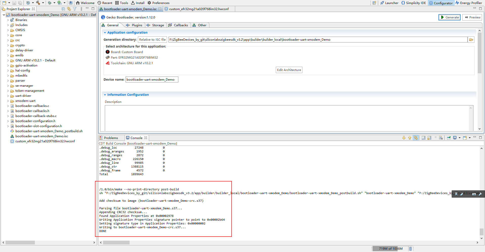

# 0 

# 1 创建 NCP 工程

## 1.1 创建 Bootloader 工程

1、选择 Bootloader

2、选择 UART XMODEM Bootloader

3、命名工程

4、选择芯片型号、编译工具

5、创建的工程如下

6、配置硬件

保存（Ctrl + S）

7、Generate 工程

8、编译工程

成功编译如下

## 1.2 创建 NCP 工程

1、选择NCP工程

2、选择硬件流控

3、选择文件存储位置

4、选择芯片型号、编译工具

5、配置硬件

保存。

6、Generate

7、编译工程

编译成功如下：

## 1.3 烧录程序至芯片

# 2 创建Host工程

## 2.1 创建

1、选择 ZigBee 工程

2、选择 Host 工程

3、选择网关

4、选择存储位置

5、Finish

6、更改工程路径

重新打开 `.isc` 文 件，工程路径如下：

7、Generate

## 2.2 编译

将创建的工程复制到 `Linux` 环境下使用 `make`命令进行编译

1、需要的协议栈目录如下：(app除外)

2、进入网关工程所在目录，使用 `make` 命令编译工程：

成功后生成可执行文件：

查找串口号：`ls /dev/ttyUSB*`

启动网关： `./build/exe/Z3GatewayHost_Demo -p ttyUSB0` 

# 3 演示

